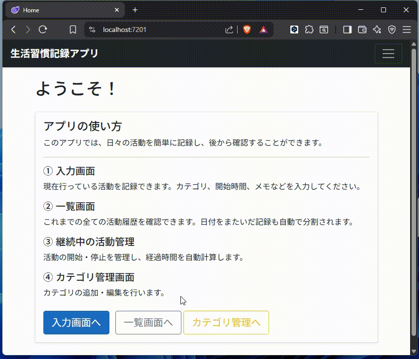
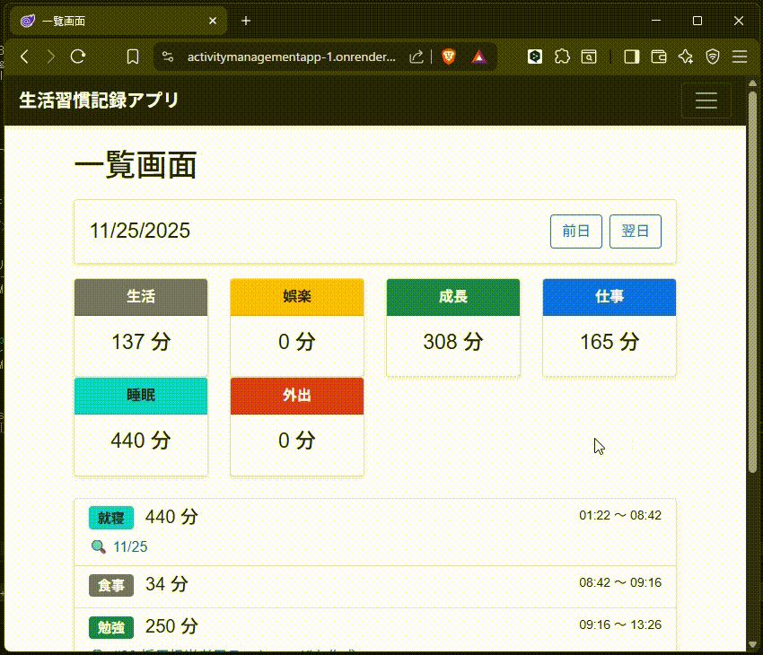
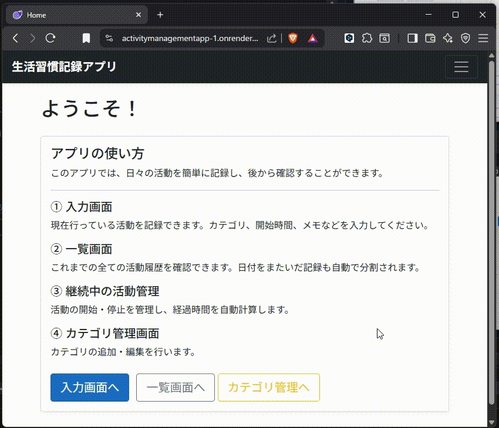

## 📌 生活習慣記録アプリ

## 🎯 Purpose
このアプリは私の以下の目的を達成するために作成しました。
- ✓毎日、何に時間を使っているかを記録し、無駄な時間をメタ認知したい。
- ✓無駄な時間を減らして、整った睡眠習慣を作りたい。
- ✓無駄な時間を減らして、新しい技術の勉強時間を作りたい。

---

## 🚀 Features
- タスク入力画面：新規タスクの登録、進行中タスクの更新 / 終了 / 削除ができます。
- タスク一覧画面：登録したタスクの一覧と、カテゴリタイプごとの合計時間を確認できます。
- タスク詳細画面：タスクの実施中に気づいたことや学んだことのメモを確認 / 編集ができます。
- カテゴリ管理画面：登録するタスクの名前（カテゴリ）の新規登録 / 編集 / 削除ができます。
 ユーザの新規登録時にはデフォルトでカテゴリが登録されているので、編集して使ってください。

---

## 🎥 Demo
<table>
  <tr>
    <th>入力画面</th>
    <th>一覧画面</th>
  </tr>
  <tr>
    <td align="center">
      
    </td>
    <td align="center">
      
    </td>
  </tr>
</table>
<table>
  <tr>
    <th>詳細画面</th>
    <th>カテゴリ管理画面(カテゴリタイプ)</th>
  </tr>
  <tr>
    <td align="center">
      
    </td>
    <td align="center">
      
    </td>
  </tr>
</table>
<table>
  <tr>
    <th>カテゴリ管理画面(カテゴリ)</th>
    <th></th>
  </tr>
  <tr>
    <td align="center">
      
    </td>
    <td>
    </td>
  </tr>
</table>

---

## 📦 Tech Stack
| Category | Technologies |
|---------|--------------|
| Frontend | Blazor / Razor Components / Bootstrap |
| Backend  | ASP.NET Core / C# |
| Database | SQL Server / EF Core |
| Infra    | Render / GitHub Actions など |
| other    | Docer |

---
